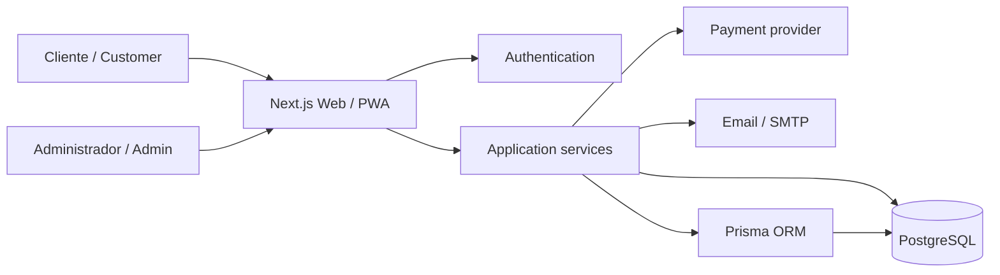

# BarberShop

### Plataforma web/PWA para agendamentos, clientes e gestão de barbearia
### *Web/PWA platform for appointments, customers and barbershop management*

**Produto em desenvolvimento ativo • Código-fonte privado**  
*Actively developed product • Private source code*

---

## 🇧🇷 Sobre o projeto

O **BarberShop** é uma plataforma criada para digitalizar a operação de uma barbearia, conectando a experiência do cliente com a gestão do negócio.

O sistema reúne agendamentos, serviços, clientes, agenda de funcionamento, pagamentos, assinaturas, comunicação por e-mail e indicadores administrativos em uma experiência preparada para web e dispositivos móveis.

A aplicação também funciona como **PWA**, permitindo uma experiência próxima de aplicativo instalado e oferecendo base para distribuição Android através de TWA/WebView quando necessário.

Este repositório é uma **vitrine pública do produto**. O código-fonte principal permanece privado.

## 🇺🇸 About the project

**BarberShop** is a platform designed to digitize barbershop operations by connecting the customer experience with business management.

The system brings together appointments, services, customers, business hours, payments, subscriptions, email communication and administrative insights in an experience built for web and mobile devices.

The application also works as a **PWA**, providing an app-like experience and a foundation for Android distribution through TWA/WebView when required.

This repository is a **public product showcase**. The production source code remains private.

---

## Principais capacidades / Core capabilities

| Área | Visão geral |
|---|---|
| **Agendamentos** | Reserva de horários com controle de disponibilidade e duração dos serviços |
| **Clientes** | Cadastro, autenticação e histórico operacional |
| **Serviços** | Serviços, preços, promoções, duração e serviços adicionais |
| **Agenda da empresa** | Dias e horários de funcionamento, pausas e datas fechadas |
| **Pagamentos** | Fluxos de cobrança e registro de formas de pagamento |
| **Assinaturas** | Planos recorrentes com controle de ciclos e utilização |
| **Administração** | Gestão operacional e visão administrativa da barbearia |
| **E-mail** | Confirmações e notificações relacionadas a agendamentos |
| **PWA / Mobile** | Experiência instalável e preparada para uso mobile |

---

## Arquitetura / Architecture

A aplicação utiliza **Next.js + React + TypeScript** no frontend e backend web, **Prisma ORM** para acesso a dados e **PostgreSQL** como banco principal.

*The application uses Next.js, React and TypeScript for the web application, Prisma ORM for data access and PostgreSQL as the primary database.*

---

## Stack principal / Main stack

### Aplicação

### Dados e autenticação

### Experiência e integração

---

## Agendamentos / Appointments

O fluxo de agendamento considera mais do que apenas escolher uma data e horário.

A operação trabalha com:

- duração individual dos serviços;
- intervalos configuráveis de agenda;
- antecedência mínima para reservas;
- dias e períodos de funcionamento;
- datas específicas de fechamento;
- pausas temporárias de operação;
- estados de agendamento como pendente, confirmado, concluído e cancelado;
- serviços adicionais vinculados ao atendimento.

*The appointment flow considers service duration, configurable scheduling intervals, minimum booking notice, business hours, closed dates, temporary pauses, appointment states and additional services.*

---

## Pagamentos e assinaturas / Payments & subscriptions

O projeto possui estrutura para diferentes modelos comerciais.

### Pagamento avulso

Agendamentos podem registrar diferentes formas de pagamento e valores associados ao atendimento.

### Assinaturas

A plataforma também suporta planos recorrentes vinculados a serviços, com controle de:

- período do ciclo;
- quantidade de utilizações disponíveis;
- status da assinatura;
- próxima cobrança;
- cancelamento e acompanhamento do ciclo atual.

A integração de pagamentos utiliza infraestrutura preparada para **Mercado Pago**, incluindo controle de intenções de cobrança e processamento de eventos do provedor.

*The platform supports both one-time payments and recurring service plans, including billing cycles, usage limits, subscription status and payment-provider event processing.*

---

## PWA e experiência mobile / PWA & mobile experience

O BarberShop é configurado como **Progressive Web App**.

Isso permite:

- instalação no dispositivo;
- manifesto próprio;
- suporte a experiência offline controlada;
- abertura em tela semelhante a aplicativo;
- possibilidade de empacotamento Android via **Trusted Web Activity (TWA)** ou WebView.

*BarberShop is configured as a Progressive Web App, enabling installation, app-like behavior, controlled offline support and optional Android packaging through Trusted Web Activity or WebView.*

---

## Comunicação / Communication

A aplicação possui infraestrutura de e-mail para automatizar comunicação relacionada aos agendamentos, como confirmação para clientes e notificações operacionais.

*The application includes email infrastructure for automated appointment-related communication, including customer confirmations and operational notifications.*

---

## Engenharia do produto / Product engineering

Alguns dos pontos técnicos trabalhados no projeto incluem:

- autenticação e controle de acesso;
- recuperação segura de senha;
- modelagem relacional de clientes, serviços e agendamentos;
- regras de disponibilidade e agenda;
- integração com provedor de pagamentos;
- processamento idempotente de eventos externos;
- assinaturas recorrentes;
- experiência PWA e mobile;
- geração de relatórios e documentos;
- separação entre experiência do cliente e administração.

*The product engineering work includes authentication, password recovery, relational data modeling, scheduling rules, payment integration, external-event processing, recurring subscriptions, PWA/mobile UX and administrative workflows.*

---

## Screenshots

As capturas de tela públicas serão adicionadas progressivamente, preservando informações pessoais de clientes, credenciais e configurações internas.

*Public screenshots will be added progressively while keeping customer information, credentials and internal configuration private.*

---

## Status

🟢 **Em desenvolvimento ativo / Active development**

O BarberShop evolui como produto completo, unindo experiência do cliente, operação diária e gestão do negócio.

*BarberShop is evolving as a complete product combining customer experience, daily operations and business management.*

---

### Desenvolvido por Igor Nayran
### *Built by Igor Nayran*

[Perfil no GitHub](https://github.com/IgorNayran)

